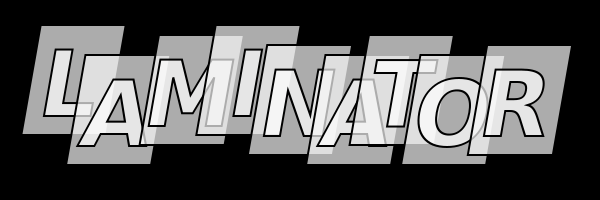

# LMNL Laminator 

A MNML LMNL processing library on an XML stack (XProc, XSLT, iXML)

MNML LMNL is Minimally Annotated Markup in LMNL (a LMNL subset). LMNL is the Layered Markup and Annotation Language (Tennison and Piez, 2001), pronounced 'liminal'. (MNML LMNL is hence 'minimal liminal'.)

Think of XML, for *markup languages*, except - (1) with a distinctive syntax, and (2) allowing overlap.

```
[excerpt [author}Robert Frost{][date}1915{][title}The Housekeeper{] }
[s}[l [n}144{]}He manages to keep the upper hand{l]
   [l [n}145{]}On his own farm.{s] [s}He's boss.{s] [s}But as to hens:{l]
   [l [n}146{]}We fence our flowers in and the hens range.{l]{s]
{excerpt]
```

In this repository you may find working code, demonstrations, and links to demonstrations. The implementation is XML-based: it uses [XProc](https://xproc.org/) and relies on XSLT and [Invisible XML](https://invisiblexml.org/). The supported subset of LMNL (MNML) aligns closely with XML, for easy handling and production of XML and HTML data and documents, as both input and output.

## In this repository

- [demo](demo) has demonstrations you can inspect and run off line (requires XProc and provided [source data](sources))
- [lib](lib) contains XProc, XSLT, and other code supporting xMNML, an XML-based representation of a document as a range model
- [papers](papers) contains any papers written so far, or links to them
- [sources](sources) contains source data ready for inspection or play
- [specs/](specs/) - some work in progress toward Specifications - what is said here is not formal, but not wrong either; and links are provided to the formalisms (grammmar, schema etc.)
- [testing/]() - tests are dispersed through the repository but linked here

LMNL markup ('sawteeth' or 'sawtooth syntax') is designed to be workable 'by hand' in a text editor, but LMNL can also be generated from XML or other structured data. 

## Prior work and acknowledgements

At different times there have been LMNL processors, both partial and complete (if not always well tested), developed by Jeni Tennison, Gavin Nicol, Alex Czmiel, Gregor Middell, Paul Caton, John Cowan and others. (Please let me know if you should be on this list.) The current developer (Wendell Piez) participated in this work from its inception, presenting my own XSLT- and XProc-based implementation, [Luminescent](https://github.com/wendellpiez/Luminescent/tree/master), in 2012.

LMNL was only one of a number of conceptual solutions offered to the "overlap problem" in XML, and their discoverers and advocates have been as important to it as its direct contributors. These include C. M. Sperberg-McQueen; Claus Huitfeld; Steven J DeRose; Patrick Durusau; Andreas Witt, Oliver Schonefeld and Maik Stührenberg; Fabio Vitali and associates; Allen Renear and associates (for work on the semantics of markup); Ronald Dekker and associates; and too many conferencers, students and colleagues to name.

## Prospectus - the Laminator

LMNL is a data model supporting applications in text processing. In contrast to XML (or object-serialization notations such as JSON) it represents a text not as a hierarchy of elements (or other constituent parts), but as a **set of ranges** defined over a  **sequence of characters**. Ranges can be named (typically by their type) and *annotated*. In MNML LMNL (the LMNL subset respected by Laminator), annotations must carry only controlled values or simple strings, but this is enough for identifiers or classifications asserting higher-level semantic properties, including links (relations) between ranges or into structured datasets. Since ranges can overlap other ranges, LMNL does not form hierarchies and represents overlap as overlap.

Applications for which this approach to markup is well suited include the analysis, translation and representation of literary texts.

Laminator is a library of functions and utilities supporting MNML LMNL (syntax and operations) on an XML stack, leveraging and capitalizing on these various dependencies:

- XML and TEI (Text Encoding Initiative)
- XProc, a pipelining and data processing language, with its implementations
- XSLT and kindred XML-centric technologies
- HTML and the web platform (for browser views)
- iXML - Invisible XML - parsing technology

## Staging applications

In its basic form, the Laminator offers a set of XProc 3.0/3.1 pipelines, to be executed using an XProc engine either from the command line (when working as a developer), within a development environment, or automated under CI/CD (continuous integration/continuous development).

This makes it possible to use the Laminator in either an active way - writing pipelines and transformations to exploit it in the service of markup-for-overlap - or in a passive mode, simply editing data (such as XML or LMNL data) and then using a Laminator-based application as a renderer - for example, generating HTML, SVG, PDF or XML outputs for study or further work.

Under either scenario these pipelines provide generalized processing in the service of xMNML, XML and LMNL 'sawtooth' syntax, to be imported and used by application logic.

A couple of simple applications using XProc and the Laminator libraries are available for study: see the [demo](demo) folder.

For more on XProc:

- [XProc 3.0/3.1 Community Portal](https://xproc.org/)
- [XProc Zone](https://wendellpiez.github.io/xproc-zone/) - by the author

## The name “Laminator”

LMNL is of course the *Layered* Markup and Annotation Language.

With the Laminator, adding and removing new layers, and examining and assessing them, should be easy, fun and rewarding of insights.

## Capabilities

In addition to parsing and serializing (reading and writing) LMNL syntax, the Laminator offers (or will offer):

- Making LMNL (and xMNML) from XML
- Merging of xMNML documents
  - Scenarios include 'text alike' (matching on offsets) and 'text unalike' (matching in other ways)
  - Range inferencing - new ranges based on heuristics and analysis
- Generating XML from MNML LMNL
  - Rebuilding hierarchies of interest
  - 'Gracefully degrade' multiple concurrent hierarchies into XML-conventional notations (e.g. milestones)
- Validation and querying
  - Validation against xMNML rules to support process integrity
  - Schemas and constraint sets for documents showing overlap
- Generating graphs and visualizations (for example, range maps)

If you have an interest and you can't find more information in the libraries, please send word.

## Relation to LMNL, the Layered Markup and Annotation Language (from 2001)

The current project is an initiative of the developer (solely), with no *direct* connection (and many indirect connections) to earlier initiatives. I remain grateful to all contributors and collaborators, and to those who have encouraged this work in its various forms, and not only the work on LMNL (since 2001) but also and more generally, work on data models and text processing altogether.

MNML LMNL is a LMNL subset selected to support a useful and interesting application profile, while being easy to specify and implement (at least by comparison). Part of the rationale is that as long as we stick close to XML technologies (which XProc and iXML permit us to do), we can turn to XML when we have well defined hierarchies.

The MNML subset is focused on providing for the capability specifically of a markup regimen supporting overlap, with the intent of allowing such layering and even overloading of semantic categories, in the metadata (the "what is known") embedded in markup.

> How do we know we know we know?
> We use markup to make it so.

For an implementation of (nearly all of) LMNL, and for more history, refer to the [Luminescent project](https://github.com/wendellpiez/Luminescent) repository.

Wendell Piez, 2025-2026

---
page created Oct 23 2025 edited 2026
