# Sonnet snapshots

With links to LMNL source data.

---

Johann Wolfgang von Goethe: *[Natur und Kunst sie scheinen sich zu fliehen](../../sources/Sonneteer/sonnets/beschraenkung.lmnl)*

---

Robert Frost: *[Never again would birds' song be the same](../../sources/Sonneteer/sonnets/birdsandeve.lmnl)*

---

John Milton: *[On his blindness](../../sources/Sonneteer/sonnets/blindness.lmnl)*

---

Charles Baudelaire: *[Correspondences](../../sources/Sonneteer/sonnets/correspondences.lmnl)*

---

Alfred, Lord Tennyson: *[Now Sleeps the Crimson Petal, Now the White](../../sources/Sonneteer/sonnets/crimsonpetal.lmnl)*

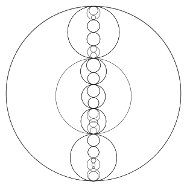

---

Henry Wadsworth Longfellow: *[The Cross of Snow](../../sources/Sonneteer/sonnets/crossofsnow.lmnl)*

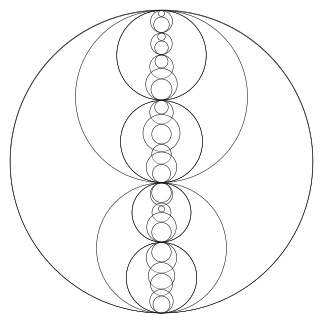

---

Sir Philip Sidney: *[Astrophel and Stella III](../../sources/Sonneteer/sonnets/daintywits.lmnl)*

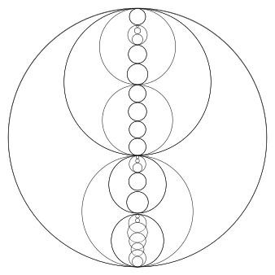

---

Lady Catherine Dyer: *[Elegy for Sir William Dyer](../../sources/Sonneteer/sonnets/dearestdust.lmnl)*

---

John Keats: *[If by dull rhymes our English must be chain'd](../../sources/Sonneteer/sonnets/dullrhymes.lmnl)*

---

John Keats: *[How many bards gild the lapses of time](../../sources/Sonneteer/sonnets/howmanybards.lmnl)*

---

Leigh Hunt: *[On receiving a crown of ivy from John Keats](../../sources/Sonneteer/sonnets/ivycrown.lmnl)*

---

Gerard Manley Hopkins: *[As kingfishers catch fire](../../sources/Sonneteer/sonnets/kingfishers.lmnl)*

---

Michael Drayton: *[Since there's no help, come let us kiss and part](../../sources/Sonneteer/sonnets/kissandpart.lmnl)*

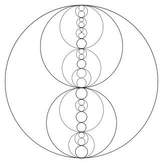

---

Francesco Petrarca: *[L’arbor gentil che forte amai molt’anni](../../sources/Sonneteer/sonnets/larborgentil.lmnl)*

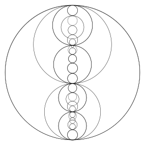

---

William Butler Yeats: *[Leda and the Swan](../../sources/Sonneteer/sonnets/ledaandswan.lmnl)*

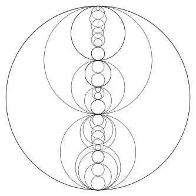

---

George Meredith: *[Lucifer in Starlight](../../sources/Sonneteer/sonnets/luciferstarlight.lmnl)*

---

George Meredith: *[Modern Love XXX](../../sources/Sonneteer/sonnets/modernlove30.lmnl)*

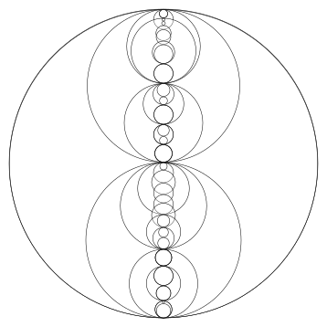

---

Dante Gabriel Rossetti: *[A Sonnet is a moment's monument](../../sources/Sonneteer/sonnets/momentsmonument.lmnl)*

---

William Beckford: *[Elegiac Sonnet to a Mopstick](../../sources/Sonneteer/sonnets/mopstick.lmnl)*

---

William Wordsworth: *[Nuns fret not at their convent's narrow room](../../sources/Sonneteer/sonnets/narrowroom.lmnl)*

---

Rainer Marie Rilke: *[Das I. Sonett](../../sources/Sonneteer/sonnets/orpheus1.lmnl)*

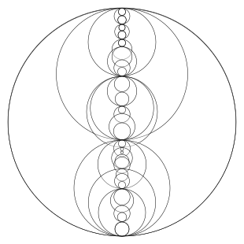

---

Percy Bysshe Shelley: *[Ozymandias](../../sources/Sonneteer/sonnets/ozymandias.lmnl)*

---

Sir Walter Raleigh: *[Sir Walter Raleigh to His Son](../../sources/Sonneteer/sonnets/raleighson.lmnl)*

---

Christina  Rossetti: *[Rest](../../sources/Sonneteer/sonnets/rest.lmnl)*

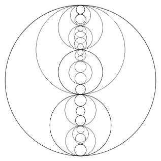

---

Robert Frost: *[A Silken Tent](../../sources/Sonneteer/sonnets/silkentent.lmnl)*

---

Francesco Petrarca: *[Soleasi nel mio cor star bella et viva](../../sources/Sonneteer/sonnets/soleasinelmiocor.lmnl)*

---

Sir Thomas Wyatt: *[Sonnet XV](../../sources/Sonneteer/sonnets/somefowls.lmnl)*

---

John Addington Symonds: *[The Sonnet (III)](../../sources/Sonneteer/sonnets/sonnetIII.lmnl)*

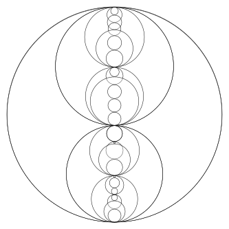

---

The Sonneteer: *[Sonnet Machine](../../sources/Sonneteer/sonnets/sonnetmachine.lmnl)*

---

Jorge Luis Borges: *[Spinoza](../../sources/Sonneteer/sonnets/spinoza.lmnl)*

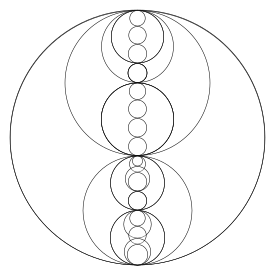

---

Edmund Spenser: *[Amoretti LXXV](../../sources/Sonneteer/sonnets/strand.lmnl)*

---

George Santayana: *[These strewn thoughts, by the mountain pathway sprung](../../sources/Sonneteer/sonnets/strewnthoughts.lmnl)*

---

Jorge Luis Borges: *[El Sueño](../../sources/Sonneteer/sonnets/sueno.lmnl)*

---

Edna St Vincent Millay: *[Time Does Not Bring Relief](../../sources/Sonneteer/sonnets/timenorelief.lmnl)*

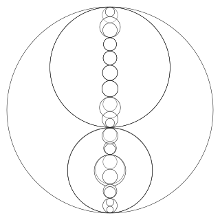

---

William Wordsworth: *[Composed Upon Westminster Bridge](../../sources/Sonneteer/sonnets/westminster.lmnl)*

---

Caroline Symmons: *[To Her Young Friend](../../sources/Sonneteer/sonnets/youngfriend.lmnl)*

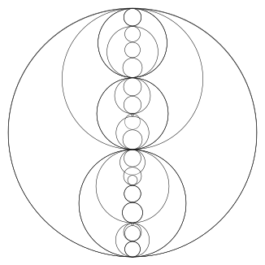