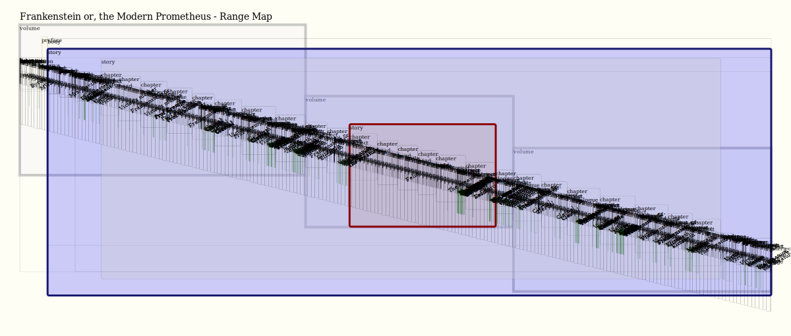
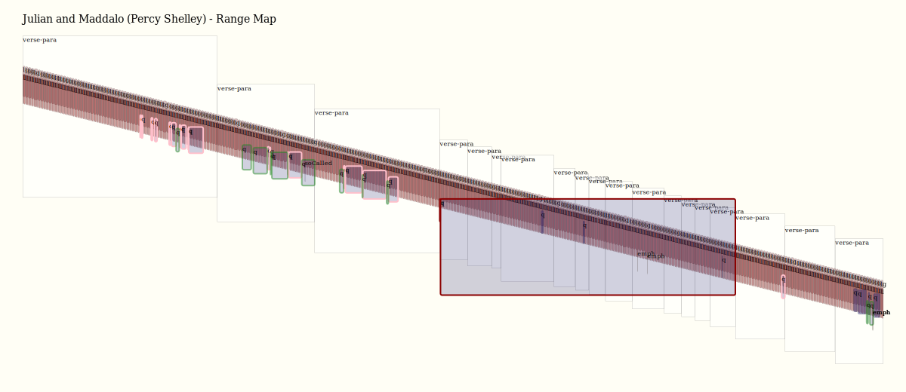
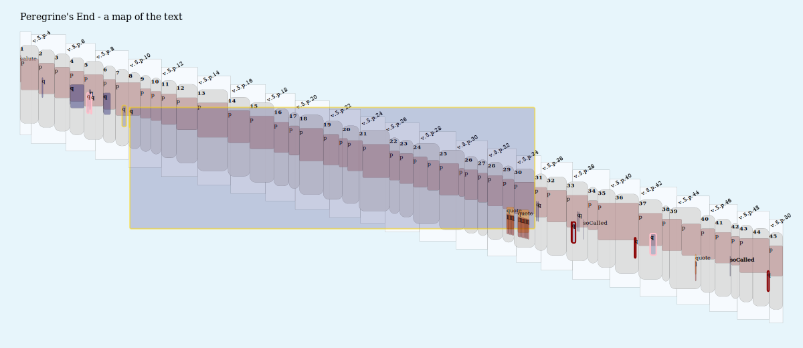

# Range Maps

One of the interesting possibilities of LMNL markup is the exploration of narrative and rhetorical structures in literary texts.

This demonstration shows a generalized approach to range mapping: drawing diagrams reflecting the internal organization of a LMNL document, or the lack thereof.

With that in mind, the current maps are crude and provide only a hint of what should eventually be possible, with some effort, tuning and design sense.

## Pipelines

[PRODUCE-RANGE-MAPS.xpl](PRODUCE-RANGE-MAPS.xpl) produces a set of range maps from a configuration kept in the pipeline.

[BUILD-BLANK-MAPSPEC.xpl](BUILD-BLANK-MAPSPEC.xpl) makes a 'blank' range map specification for a new LMNL instance. Currently set to operate on one of the samples, it can be called with any LMNL document on the source port to make a new range map specification covering its ranges.

## The maps

The design of the (so called) <q>range map</q> is a variant on the classic Bubble Diagram as applied to narrative structure, as outlined in LMNL markup.

[For comparison](http://wendellpiez.com/FrankensteinTransformed/FrankensteinTransformed-20150219.svg), see a 2015 example of such a bubble diagram for Frankenstein produced from the Luminescent pipeline.)

Instead of bubbles, now ranges are represented by rectangles with square or rounded corners, arranged diagonally from top-left to bottom-right.

The main aim for the current design is *not* a diagram suitable for publication, which is regarded as a nice-to-have. Rather, it is to support *interactive discovery and heuristic analysis* of the texts in question - that is, to show things about the text to any student who cares to look closely, trace what they see, and retrace their steps with the help of the machine.

In addition to producing diagrams with high enough production values to publish, another direction (not pursued here) is to create interactive displays working in the browser.

The configuration for any range map dictates:

 - Which ranges are to be shown
 - Vertical sizing and displacement for easier visual distinction
 - SVG properties to be assigned to any range lozenge (rectangle) - color, border width, fill opacity etc.
 - Special features for qualified ranges (filtered by annotation value)
 - Labels hard-coded or derived from the document

See examples of range maps in the [specs folder](specs/). Range maps can be tuned per instance, or used over families of similarly tagged documents.

## The texts

<b>Frankenstein 1831</b>

Borrowed from Luminescent, [this transcription](data/Frankenstein1831.lmnl) of the Mary Shelley novel has a history back to e-text centers of the 1990s. The text of the 1831 edition is used, since this is the edition still most commonly read. (Since its revisions are at the line and word-choice level, a representation of this edition's structure is practically the same as that of the 1818 edition.) Despite these being obscured in later print editions, the three-volume structure of the novel as originally published is also shown.

<b>Julian and Maddalo</b>

Also borrowed from Luminescent. This shows a verse structure with a nested narrative.

A narrative poem in rhymed couplets (with an occasional tercet), the markup here captures verse lines, structures, nested quotations and dialogue. Much of it consists of debate between the characters named in the title, which serve as 'types' for Shelley and his friend Byron respectively. In the middle is a nested narrative related by a third character, noted in the markup as `madman`.

<b>Peregrines' Demise</b> by Lucian of Samosata (ca 165 CE)

The original text was downloaded from Perseus and worked by the author.

It shows several overlapping structures including:

- episodes mainly but not entirely overlapping paragraphs
- episodes overlapping marked pages
- pages overlapping paragraphs
- speeches (extended quotes) overlapping all of these
- verse quotations

