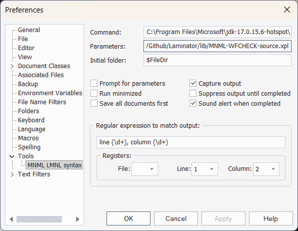

# Editing LMNL in TextPad

TextPad is a plain text editor developed by Helios Software, available from textpad.com. These instructions have been tested for Textpad version 9.6.6.

TextPad is 'nagware': free to install and run, but with periodic notifications to the user requesting a license until one is provided. (They are inexpensive). It is also:

- Lightweight and lean especially by today's standards
- Capable, well designed, and intelligible
- Supports extensible document types, such as LMNL
  - with syntax coloring
- Provides a clip library feature adaptable for use supporting LMNL markup
- Provides controls to run external tools such as XProc pipelines for on-the-fly checking

## MNML LMNL parse checking as a TextPad Tool

With this configuration, you can parse a LMNL document in TextPad with a button or keystroke.

Parsing the document frequently while editing assures the syntax stays orderly, as is required for all subsequent processing. A pipeline from the repository can perform this operation, reporting back the status of a parse (erroneous or presumed successful) on completion.

In Textpad, open Configure/Preferences

Select the Tools option

Add a new tool with the "Add" pulldown, selecting "Program". Use the dialog box to find "java.exe" on your system (wherever you have a current Java Runtime). If you like, remove unwanted tools.

Add the new tool and rename it to **MNML LMNL syntax check** or as you prefer.

Outside Textpad, find and copy (to your clipboard) a `file:` URI on your system for the file `MNML-WFCHECK-source.xpl` in the Laminator `lib/` folder. You will need the path to this file in the next step.

Back in Textpad, expand "Tools" to find your new tool, and configure it:

- **Command** shows the path to your JRE
- **Parameters** as follows (adjusting the paths): `-jar "C:\bin\XML Calabash\xmlcalabash-3.0.36\xmlcalabash-app-3.0.36.jar" --input:text/plain@source=$Filename file:/path/to/Laminator/lib/MNML-WFCHECK-source.xpl`
- **Initial folder**: `$FileDir`
- Select the checkboxes 'Capture Output' and 'Sound alert when completed' or others (if wanted)
- Fill in the **Regular expression to match output**: `line (\d+), column (\d+)`

A screenshot shows a Preferences panel with a configuration shown.

## Syntax coloring for LMNL syntax

The file `lmnl.syn` in this folder can be used in Textpad to color tagging. Place a copy of this file in your folder for Textpad, as in `C:\Users\user\AppData\Roaming\Helios\TextPad\9\lmnl.syn`

In **Options/Preferences** add a new entry for "LMNL" to the list of **Document Classes**.

Under the new entry, find and select `lmnl.syn` as the syntax file.

Adjust colors and other preferences as wanted.

In the Settings for the new Document Class, be sure **Default Encoding** is set to `UTF-8` and **Create new files as** is set to `UNIX`.

## Clip libraries

The Textpad Clip Libraries are useful for LMNL tagging. Selected text can be wrapped in a clip, which can represent start/end tag pairs. You will want to make clips for your vocabulary. These files can also be shared.

Use the right-mouse button (context menu) on the Clip Library selector pulldown to add new Clip Libraries, and on the Clip library itself to add new items. (Tip: select a run of text as for copying, and a clip will be created from your clipboard buffer.)

## LMNL File Name Filter

By adding `LMNL Files (*.lmnl)` as an option among the **File Name Filters** under **Configure / Preferences** you can induce Textpad to see LMNL files and treat them as you want.

## Useful Textpad Features

For whatever reason Textpad hits a sweet spot for lightweight markup processing, at least for those not fortified by Emacs or spoiled by BBEdit.

Its search/replace is powerful. For example, using Textpad search/replace alone, you can add markup to number the lines in your poem.

Another useful feature is the **Mark Flags**.

---
20260801