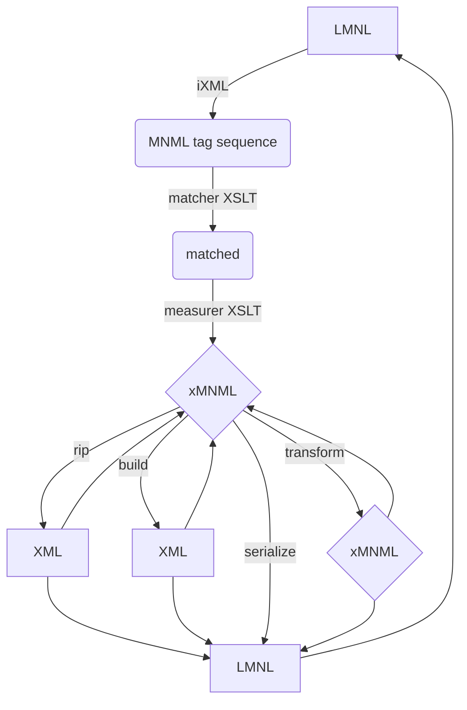
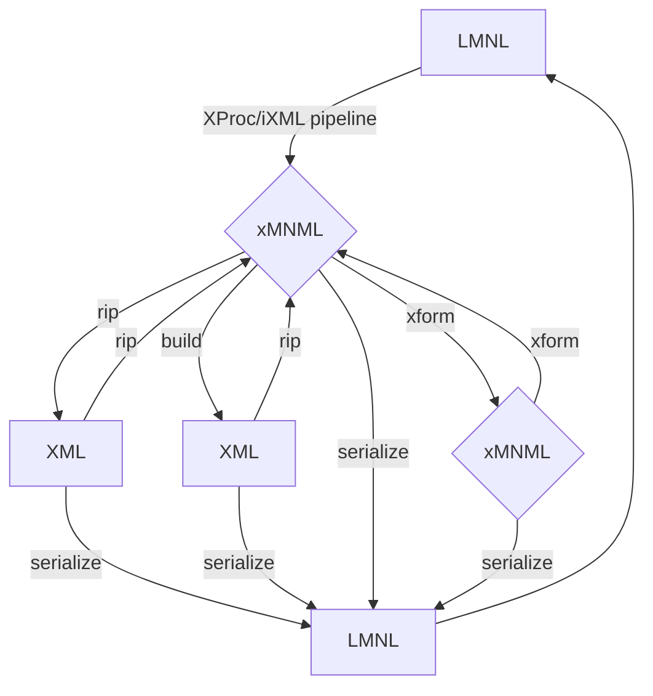

# Laminator libraries

Generic code for working with MNML LMNL.

See the readme documents and code base for the current state.

Test pipelines and XSpec tests can be found close to their test targets.

## Functions and capabilities

Planned and underway:

### Acquisition

- Parsing LMNL syntax (MNML subset) to build xMNML (XML)
- Converting XML into xMNML

### Expression

- Producing LMNL syntax from xMNML - LMNL serialization
- Producing XML from xMNML - building trees from ranges
- 'Ripping' XML when possible

### Support

- Serializing XML in LMNL syntax
- Process xMNML natively:
  - To modify documents
  - To filter and merge range sets
  - Validation, diagnostics, restoration
  - Analytics

## Conceptual map

Cornered rectangles - i.e., only XML and LMNL - will take the form of persistent data objects on your system. Everything else is internal to pipelines and not visible to the end user, only to developers and builders.

Here is the same architecture, except with more labels, and the MNML LMNL parsing steps are reduced to a black box, "XProc/iXML Pipeline".

### Ripping and building: xMNML to XML, XML to xLMNL

In the diagram, *build* refers to a process that produces XML from xMNML by a hierarchical node traversal - guaranteeing XML results from any xMNML input, at the cost of splitting ranges across element boundaries when they overlap.

In contrast, *rip* refers to a process that emits XML from xMNML -- or an xMNML 'tag stream' from XML -- using some form of 'tag writing'.

This is a cheap-and-easy (and fast) way to convert xMNML when its fitness for such conversion is known in advance; and such fitness can be assessed according to known rules (in brief: no overlap; correctly nested start-end sequencing; no anonymous ranges or annotations, or annotations with the same name on the same range). But it will fail in the face of unhandled overlap among ranges in the xMNML source, when the results break the XML end-tag matching rule.

And XML always safely "rips" into xMNML because XML has no overlap to be a problem in xMNML, if that were a problem.

Both "ripping" and "building" can include other operations in the conversion, such as removing ranges of certain types (so corresponding elements do not break hierarchies), rewriting end-tag/start-tag pairs into XML 'milestones', or other manipulations. Careful "ripping" from XML can be a good way to see overlaps that are not rendered explicitly in source XML, but can become true ranges (marked with starts and ends) when ripped.

---
end

