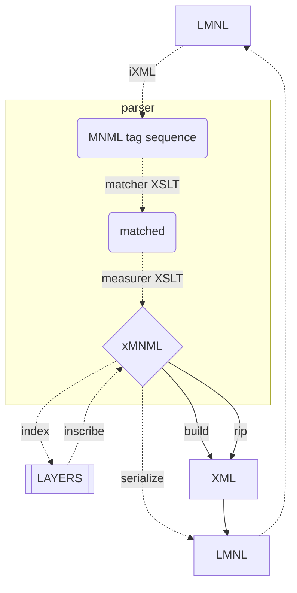
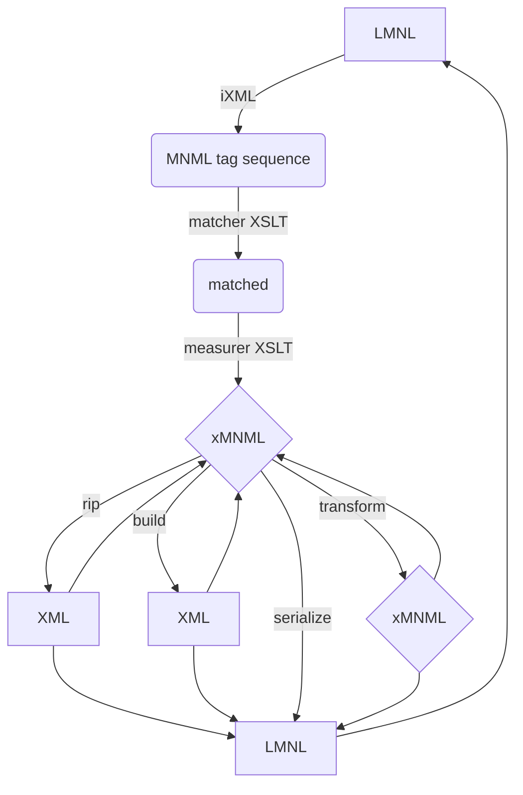
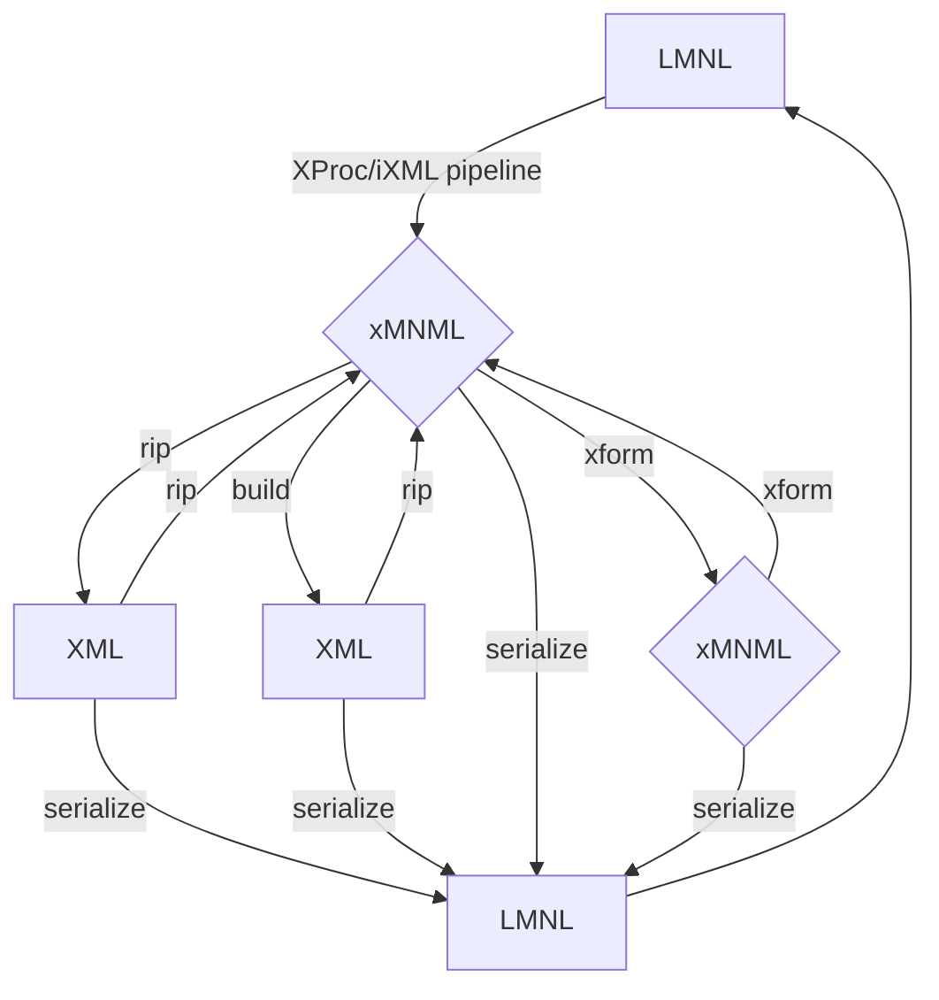

# Laminator libraries

Generic code for working with MNML LMNL.

See the readme documents and code base for the current state.

Test pipelines and XSpec tests can be found close to their test targets.

## TODO

BUILD OUT 'LAYERS' model support
  XSLT xMNML-ranges.xsl ../demo/baselines/data/PLfragment.lmnl
  Schema for LAYERS model 

  with XSpec tests for regression testing
  capabilities: MERGE; INSCRIBE; produce XML (xMNML/out/xMNML-build-xml.xsl)
REFRESH/TEST ALL DEMOS
Rearrange 'lib'
  clear out 'misc'
  fix up TEI
  document

## xMNML

An XML-based format representing a LMNL document as a sequence of tags (as elements) interleaving text (as elements).

## LAYERS

ArRANGEd Standoff

This is also an XML-based format, representing the LMNL range model in 'bare bones' form as a collection of sequences of ranges ('layers') defined in reference to a text.

A transparent, bidirectional, lossless conversion pathway between xMNML and LAYERS provides the library with a synthesis of their capabilities.

Generally speaking, xMNML comes into play when working directly with LMNL "sawtooth" syntax.

The LAYERS model comes into play when we wish to perform operations directly on the range sequences, for example merging two range sequences to provide a document combining two sets of markup (possibly overlapping).

## Functions and capabilities

Planned and underway:

xMNML -> LAYERS
LAYERS -> xMNML (from xMNML/out/xMNML-reinscribe.xsl)

demo roundtrip
RUNALL to run everything for testing
finish todo / document
clean up!

### Acquisition

- Parsing LMNL syntax (MNML subset) to build xMNML (XML)

Use parse_MNML-LMNL.xpl

- Converting XML into xMNML

Use any of:

 - `common/xml-to-lmnl.xsl` 'rips' LMNL tags from XML
 - xMNML/in/w3c-xml/xml-to-xMNML.xsl does the same, except directly into xMNML with no parse required
 - LAYERS/in/xml-to-LAYERS.xsl converts XML directly into a LAYERS representation for further processing - a very convenient and fast way to get XML
 
Note that using a combination of XML-in and XML-out pathways to and from the LAYERS model, we can skip parsing altogether, and use LMNL with plain-old XML.

You expect to do a great deal of rewriting of milestones as delimiters and milestone-delimited spans as ranges, but it should work. Indeed, rewriting a milestone start/end pair to mark a single range is trivial to do in the RANGES model, more so even than in other forms.

### Expression

- Producing LMNL syntax from xMNML - LMNL serialization
- Producing XML from xMNML - building trees from ranges
- 'Ripping' XML when possible

There is no LAYERS to XML pathway ('building' XML) since the build algorithm works by recursively grouping marked segments of text, which are not available in the LAYERS model (only in the xMNLM tag sequence model). Creating these entails performing the same operation as an xMNML 'inscription', so we do that: first, inscribe as xHTML (you will get LMNL back with tag order corrected if necessary), then making the XML is easy (by building if an MCH or 'mixed' model, or 'ripping' if an OHCO).

Since the generic LAYERS/in/xMNML-LAYERS.xsl converter XSLT also marks layers as 'ohco', 'mch' or 'mixed' (by default), it is a useful way of seeing what can reasonably be done.

## Conceptual map

A mermaid flowchart diagram shows the moving pieces.

Any process can be assumed to be XSLT even if functionally very simple ('tag writing').

TBD (potentially) - shortcuts implemented as direct transformations (while we are doing our best to factor out complexity) - e.g. the XML builder could work on both xMNML and LAYERS inputs

```mermaid
flowchart TD
    lmnlIN[LMNL] -.->|iXML| lmnlTAGS(MNML tag sequence)
    subgraph parser
    lmnlTAGS -.->|matcher XSLT| MATCHED(matched)
    MATCHED -.->|measurer XSLT| XMNML{xMNML}
    end
    
    lmnlOUT -.-> lmnlIN
    XMNML -.->|serialize| lmnlOUT[LMNL]
    XMNML  -.->|index| LAYERS[[LAYERS]]
    LAYERS -.->|inscribe| XMNML
 
    XMNML  -->|build| xmlOUT[XML]
    XMNML  -->|rip| xmlOUT[XML]
    xmlOUT --> lmnlOUT

```

A few pathways are not shown in the picture, for example converting directly from XML straight into xLMNL or LAYERS, not via LMNL tagging.

The LAYERS model is useful

- For certain kinds of operations such as filtering and merging range sets
  - remove all ranges of certain kinds
  - supplement with new range sets indexed into the text
    - just add the new ranges and unify IDs
  - rewrite ranges into marked segments (converting start/end to empty milestones)
  - sort ranges into layers (hierarchies) / capture MCH
  - navigate a schema (proxy) to create an instance? (alternative to XML build)

- For normalizing, cleaning up, testing an xMNML document for integrity
  - a well-ordered, complete and correct xMNML document will convert losslessly, otherwise not

### Version prior to April 2026

Cornered rectangles - i.e., only XML and LMNL - will take the form of persistent data objects on your system. Everything else is internal to pipelines and not visible to the end user, only to developers and builders.

```mermaid
flowchart TD
    lmnlIN[LMNL] -->|iXML| lmnlTAGS(MNML tag sequence)
    lmnlTAGS -->|matcher XSLT| MATCHED(matched)
    MATCHED -->|measurer XSLT| XMNML{xMNML}
    lmnlOUT --> lmnlIN
    XMNML -->|rip| XMLOUT1[XML]
    XMNML-->|transform| xmnmlOUT{xMNML}
    XMLOUT1 --> lmnlOUT
    XMLOUT1 --> XMNML
    XMNML -->|build| xmlOUT2[XML]
    xmlOUT2 --> XMNML
    xmlOUT2 --> lmnlOUT
    XMNML -->|serialize| lmnlOUT[LMNL]
    xmnmlOUT --> lmnlOUT
    xmnmlOUT --> XMNML
```

Here is the same architecture, except with more labels, and the MNML LMNL parsing steps are reduced to a black box, "XProc/iXML Pipeline".

```mermaid
flowchart TD
    lmnlIN[LMNL] -->|XProc/iXML pipeline| XMNML{xMNML}
    lmnlOUT --> lmnlIN
    XMNML -->|rip| XMLOUT1[XML]
    XMNML-->|xform| xmnmlOUT{xMNML}
    XMLOUT1 -->|serialize| lmnlOUT
    XMLOUT1 -->|rip| XMNML
    XMNML -->|build| xmlOUT2[XML]
    xmlOUT2 -->|rip| XMNML
    xmlOUT2 -->|serialize| lmnlOUT
    XMNML -->|serialize| lmnlOUT[LMNL]
    xmnmlOUT -->|serialize| lmnlOUT
    xmnmlOUT -->|xform| XMNML
```

### Ripping and building: xMNML to XML, XML to xLMNL

In the diagram, *build* refers to a process that produces XML from xMNML by a hierarchical node traversal - guaranteeing XML results from any xMNML input, at the cost of splitting ranges across element boundaries when they overlap.

In contrast, *rip* refers to a process that emits XML from xMNML -- or an xMNML 'tag stream' from XML -- using some form of 'tag writing'.

This is a cheap-and-easy (and fast) way to convert xMNML when its fitness for such conversion is known in advance; and such fitness can be assessed according to known rules (in brief: no overlap; correctly nested start-end sequencing; no anonymous ranges or annotations, or annotations with the same name on the same range). But it will fail in the face of unhandled overlap among ranges in the xMNML source, when the results break the XML end-tag matching rule.

And XML always safely "rips" into xMNML because XML has no overlap to be a problem in xMNML, if that were a problem.

Both "ripping" and "building" can include other operations in the conversion, such as removing ranges of certain types (so corresponding elements do not break hierarchies), rewriting end-tag/start-tag pairs into XML 'milestones', or other manipulations. Careful "ripping" from XML can be a good way to see overlaps that are not rendered explicitly in source XML, but can become true ranges (marked with starts and ends) when ripped.

---
end

