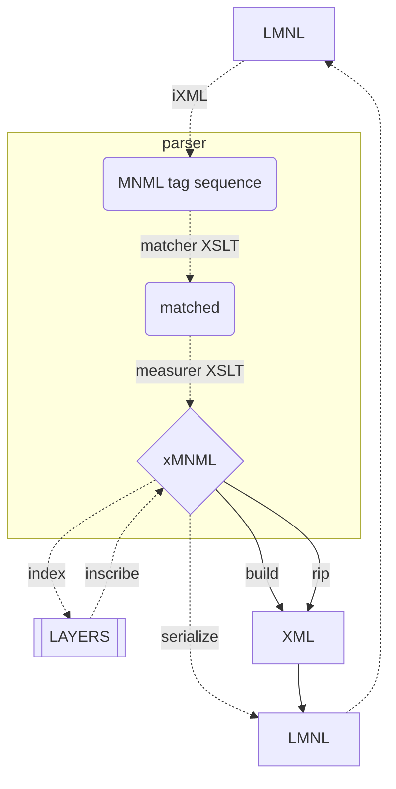
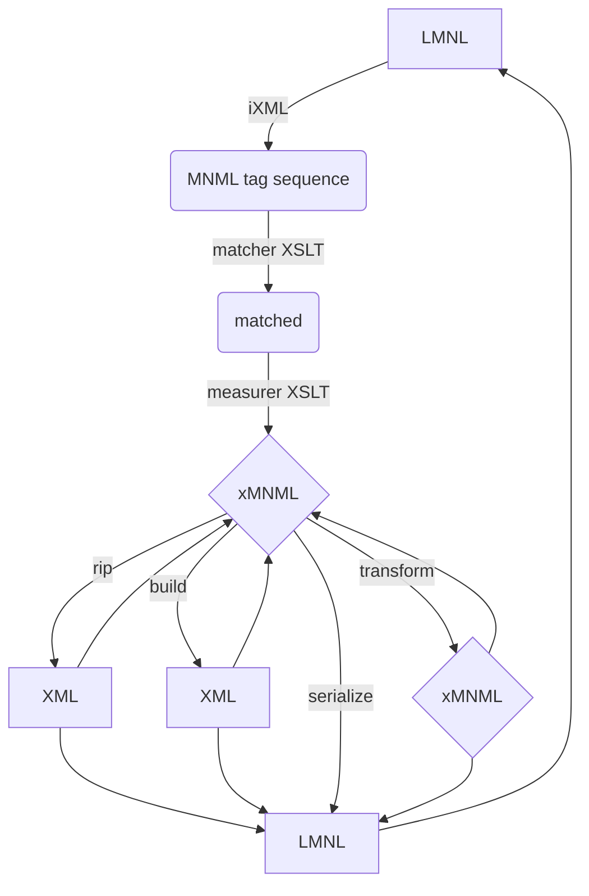
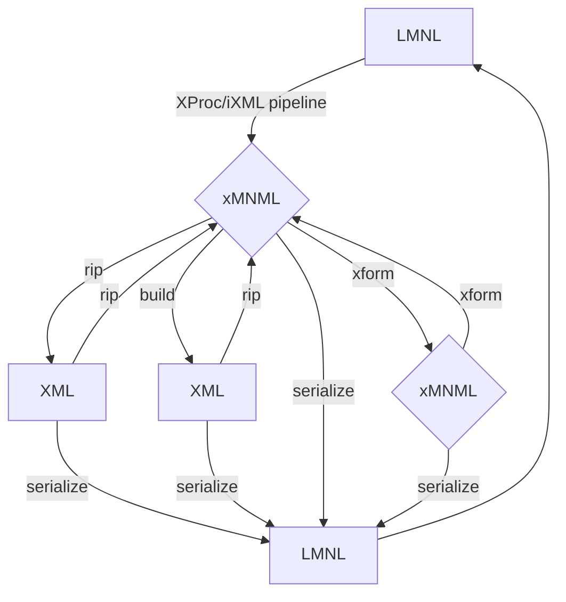

# Laminator libraries

Generic code for working with MNML LMNL.

See the readme documents and code base for the current state.

Test pipelines and XSpec tests can be found close to their test targets.

## TODO

o document top/down

how to use the Laminator

o Putting together a pipeline
  o XML source
  o LMNL source (as plain text)
  o capturing results
o Starting with XML
  o convert to LMNL tags
  o or, go straight into xMNML or RANGES
o Starting with LMNL
o pivoting from xMNML
    o 'ripping' XML (the 'wrong' way)
    o building XML (the 'right' way)
    o back to LMNL
    o out to RANGES
o pivoting from RANGES
    o merging, filtering
    o sorting, renaming
    o handling IDs and avoiding clashes
    o handling range synonymy / congruity
    o hierarchies
      o detecting and distinguishing
      o @form = (ohco|mch)?
    o inscribing (tags) back to xMNML
    o or, go straight to XML ('ripping') w/o xMNML tags en route
o XPath matching xMNML
o XPath matching RANGES
o Range signatures
    
How Laminator works
  xMNML - tags in a sequence
    needs a specification.md
      schema + rules
      referential integrity
  RANGES - abstracted range model
    needs a specification.md
  lossless conversion between models
    Can be tested
    (exposes the deltas, e.g. around tag ordering and whitespace)
  two models offer two different 'surfaces' for operations
    directly over ranges
    or via tagging/inferencing

Keep reading - much of this is detailed below.

## Models

Two complimentary models work together. Each model represents a complete MNML LMNL document (as an information set), in a different form suitable for processing and querying:

- xMNML represents a LMNL document as a 'tag and text sequence'
- LAYERS represents a LMNL document as a set of (one or more) collections of ranges ('layers') defined in relation to a common base text (the 'frontier')

Converting an xMNML LMNL represtation into a LAYERS representation and back has the effect of normalizing tag order in the source data but leaving it otherwise unchanged.

If tag order is important in your LMNL, include spaces or content between your tags.

Use the tag sequence model whenever conversion to and from XML is needed.

Use the LAYERS model to perform global operations in the application.
Use LMNL syntax when editing LMNL directly.

### xMNML

An XML-based format representing a LMNL document as a sequence of tags (as elements) interleaving text (as elements). As an XML-based format it is handled internally by XProc as in-memory (or in-cache) XDM (XPath and XQuery Data Model 3.0).

It has a schema at `xMNML/rules/xMNML.rnc` and a comparability XSLT that produces a normalized version of an xMNML instance, for comparison.

xMNML is most useful for two things - an intermediate format when reading (parsing) LMNL syntax, and when writing (producing) either XML or LMNL syntax. It can also be used ('creatively' taking advantage of its features) in place of the RANGES model, for range manipulations, querying and filtering.

Interestingly, while we do not need the xMNML model to produce a LAYERS representation of an XML document (wherein elements are identified with ranges covering their contents), we do need something like it to produce XML from LAYERS input.

### LAYERS

This is also an XML-based format -- XDM inside XProc -- representing the LMNL range model in 'bare bones' form as a collection of sequences of ranges ('layers') defined in reference to a text, the 'frontier'.

The more concise notation has several advantages for processing: it --

- Is simpler to address when processing ranges as such (e.g., producing SVG Range Maps)
- Is simpler to sift, filter, merge, interpolate
- Resolves some kinds of anomalies in inputs
- Exposes some modeling ambiguities around ranges and tag ordering

### Using the models together

A transparent, bidirectional, lossless conversion pathway between xMNML and LAYERS provides the library with a synthesis of their capabilities.

In XProc, pipelines that consume either model (as XDM) can expose the other, when convenient.

## Functions and capabilities

Keep in mind the library's functionalities are all very basic, and require additional logic (use XSLT in your pipelines) to do useful work.

### Data acquisition

#### LMNL input

To parse LMNL syntax (MNML subset) to build xMNML (XML), use the pipeline `parse_MNML-LMNL.xpl`

#### XML input

Sourcing from XML can be convenient if only because it is available. Overlapping structures are commonly marked by partitioning or by using milestone-marking conventions. In either case, depending on the strategy used, these can often be mapped *on the way into xMNML* into 'proper' ranges. 

Use any of:

 - `common/xml-to-lmnl.xsl` 'rips' LMNL tags from XML
 - `xMNML/in/w3c-xml/xml-to-xMNML.xsl` does the same, except directly into xMNML, no LMNL syntax and no (re)parse require
 - `LAYERS/in/xml-to-LAYERS.xsl` converts XML directly into a LAYERS representation for further processing - a very convenient and fast way to get XML
 
Note that using a combination of XML-in and XML-out pathways to and from the LAYERS model, we can also skip LMNL tagging altogether, and use the Laminator with "plain-old XML".

### Expression

What we can do so far is pretty basic but also very general and useful for just about anything.

- Producing LMNL syntax from xMNML - LMNL serialization
- Producing XML from xMNML - building trees from ranges
- 'Ripping' XML from xMNML when possible

- Producing other renditions e.g. SVG range maps, from either xMNML or LAYERS models

NB: There is no LAYERS to XML pathway ('building' XML) since the build algorithm works by recursively grouping marked segments of text, which are not available in the LAYERS model (only in the xMNLM tag sequence model). Creating these entails performing the same operation as an xMNML 'inscription', so we do that: first, inscribe as xHTML (you will get LMNL back with tag order corrected if necessary), then making the XML is easy (by building if an MCH or 'mixed' model, or 'ripping' if an OHCO).

Since the generic LAYERS/in/xMNML-LAYERS.xsl converter XSLT also marks layers as 'ohco', 'mch' or 'mixed' (by default), it is a useful way of seeing what can reasonably be done.

### Manipulation

Most of this work hasn't been done yet since the focus on manipulating LMNL directly will first and foremost be in its uses as a *markup language*, i.e. manipulate it 'by hand'.

That being said, many manipulations are possible and easy working with either or both xMNML or LAYERS models.

For example it is straightforward to use the LAYERS model to produce two XML documents from the same LMNL source, showing its multiple concurrent hierarchies.

Merging and sifting ranges and range types is one of the most basic and useful things we can do with LMNL.

## Conceptual map

A mermaid flowchart diagram shows the moving pieces.

Any process can be assumed to be XSLT even if functionally very simple ('tag writing').

TBD (potentially) - shortcuts implemented as direct transformations (while we are doing our best to factor out complexity) - e.g. the XML builder could work on both xMNML and LAYERS inputs

```mermaid
flowchart TD
    lmnlIN[LMNL] -.->|iXML| lmnlTAGS(MNML tag sequence)
    subgraph parser
    lmnlTAGS -.->|matcher XSLT| MATCHED(matched)
    MATCHED -.->|measurer XSLT| XMNML{xMNML}
    end
    
    lmnlOUT -.-> lmnlIN
    XMNML -.->|serialize| lmnlOUT[LMNL]
    XMNML  -.->|index| LAYERS[[LAYERS]]
    LAYERS -.->|inscribe| XMNML
 
    XMNML  -->|build| xmlOUT[XML]
    XMNML  -->|rip| xmlOUT[XML]
    xmlOUT --> lmnlOUT

```

A few pathways are not shown in the picture, for example converting directly from XML straight into xLMNL or LAYERS, not via LMNL tagging.

The LAYERS model is useful

- For certain kinds of operations such as filtering and merging range sets
  - remove all ranges of certain kinds
  - supplement with new range sets indexed into the text
    - just add the new ranges and unify IDs
  - rewrite ranges into marked segments (converting start/end to empty milestones)
  - sort ranges into layers (hierarchies) / capture MCH
  - navigate a schema (proxy) to create an instance? (alternative to XML build)

- For normalizing, cleaning up, testing an xMNML document for integrity
  - a well-ordered, complete and correct xMNML document will convert losslessly, otherwise not

---

### Version prior to April 2026

Cornered rectangles - i.e., only XML and LMNL - will take the form of persistent data objects on your system. Everything else is internal to pipelines and not visible to the end user, only to developers and builders.

```mermaid
flowchart TD
    lmnlIN[LMNL] -->|iXML| lmnlTAGS(MNML tag sequence)
    lmnlTAGS -->|matcher XSLT| MATCHED(matched)
    MATCHED -->|measurer XSLT| XMNML{xMNML}
    lmnlOUT --> lmnlIN
    XMNML -->|rip| XMLOUT1[XML]
    XMNML-->|transform| xmnmlOUT{xMNML}
    XMLOUT1 --> lmnlOUT
    XMLOUT1 --> XMNML
    XMNML -->|build| xmlOUT2[XML]
    xmlOUT2 --> XMNML
    xmlOUT2 --> lmnlOUT
    XMNML -->|serialize| lmnlOUT[LMNL]
    xmnmlOUT --> lmnlOUT
    xmnmlOUT --> XMNML
```

Here is the same architecture, except with more labels, and the MNML LMNL parsing steps are reduced to a black box, "XProc/iXML Pipeline".

```mermaid
flowchart TD
    lmnlIN[LMNL] -->|XProc/iXML pipeline| XMNML{xMNML}
    lmnlOUT --> lmnlIN
    XMNML -->|rip| XMLOUT1[XML]
    XMNML-->|xform| xmnmlOUT{xMNML}
    XMLOUT1 -->|serialize| lmnlOUT
    XMLOUT1 -->|rip| XMNML
    XMNML -->|build| xmlOUT2[XML]
    xmlOUT2 -->|rip| XMNML
    xmlOUT2 -->|serialize| lmnlOUT
    XMNML -->|serialize| lmnlOUT[LMNL]
    xmnmlOUT -->|serialize| lmnlOUT
    xmnmlOUT -->|xform| XMNML
```

### Ripping and building: xMNML to XML, XML to xLMNL

In the diagram, *build* refers to a process that produces XML from xMNML by a hierarchical node traversal - guaranteeing XML results from any xMNML input, at the cost of splitting ranges across element boundaries when they overlap.

In contrast, *rip* refers to a process that emits XML from xMNML -- or an xMNML 'tag stream' from XML -- using some form of 'tag writing'.

This is a cheap-and-easy (and fast) way to convert xMNML when its fitness for such conversion is known in advance; and such fitness can be assessed according to known rules (in brief: no overlap; correctly nested start-end sequencing; no anonymous ranges or annotations, or annotations with the same name on the same range). But it will fail in the face of unhandled overlap among ranges in the xMNML source, when the results break the XML end-tag matching rule.

And XML always safely "rips" into xMNML because XML has no overlap to be a problem in xMNML, if that were a problem.

Both "ripping" and "building" can include other operations in the conversion, such as removing ranges of certain types (so corresponding elements do not break hierarchies), rewriting end-tag/start-tag pairs into XML 'milestones', or other manipulations. Careful "ripping" from XML can be a good way to see overlaps that are not rendered explicitly in source XML, but can become true ranges (marked with starts and ends) when ripped.

---
end

