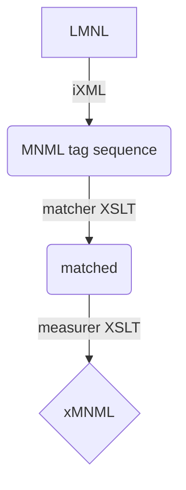

# Parsing LMNL Sawtooth Syntax into xMNML

Everything has been built and tested using XML Calabash 3.0.x for XProc and MarkupBlitz as an iXML processor.

## Pipeline `sawteeth-to-xMNML.xpl`

The main [sawtooth syntax parser](sawteeth-to-xMNML.xpl) combines traditional parsing functions (parsing and lexing) in three steps to produce xMNML as its result.

In the first step an iXML grammar is applied to the input text to render out its 'tags' (start-, end- and empty range markers) from its text. In subsequent steps these are enhanced by matching them up and assigning properties based on their relations.

[iXML grammar](src/mnml-lmnl.ixml) - [example result](../../../../demo/baselines/cache/1_parsed/Housekeeper144-146.xml)

XSLT 1: [matching](src/mnml-matching.xsl) - matches start/end tag pairs, unescapes text contents, distinguishes type names from range identifiers in tags, and marks 'coverage' of ranges over text - [example result](../../../../demo/baselines/cache/2_linked/Housekeeper144-146.xml)

XSLT 2: [measuring](src/mnml-measuring.xsl) - measures offsets and extents (start positions and lengths) of ranges - [example result](../../../../demo/baselines/cache/3_xmnml/Housekeeper144-146-xMNML.xml)

These can be [run](../../../../demo/baselines/xMNML-BUILD.xpl) and [tested](../../../../demo/baselines/TEST_xMNML-BUILD.xpl) live using XProc pipelines.

Also see testing in this folder.

## Utility pipelines

[mnml-lmnl_wf-check.xpl](mnml-lmnl_wf-check.xpl) encapsulates a 'well-formedness' check over an XML document to determine if it qualifies as an xMNML document.

[TEST_WFCHECK-SAWTEETH.xpl](TEST_WFCHECK-SAWTEETH.xpl) calls the well-formedness check over a sequence of known-good and known-bad examples, reporting if their results align with expectations. This is useful for testing and confirming that functionality aligns with expectations, in both routine and edge cases.

[xMNML-cleaner.xpl](xMNML-cleaner.xpl) - for stripping insignificant whitespace from an xMNML instance - useful for comparing them as XML (where whitespace discrepancies create noise).