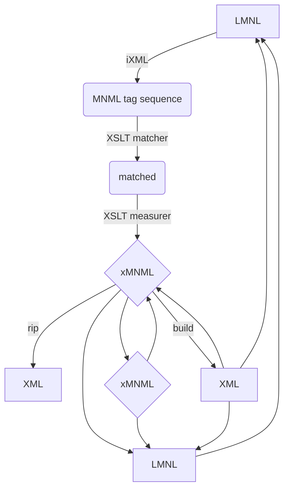

# Parsing LMNL Sawtooth Syntax into xMNML

For iXML, try MarkupBlitz.

## Conceptual map

Cornered rectangles - i.e., only XML and LMNL - will take the form of persistent data objects on your system. Everything else is internal to pipelines and not visible to the end user, only to developers and builders.

