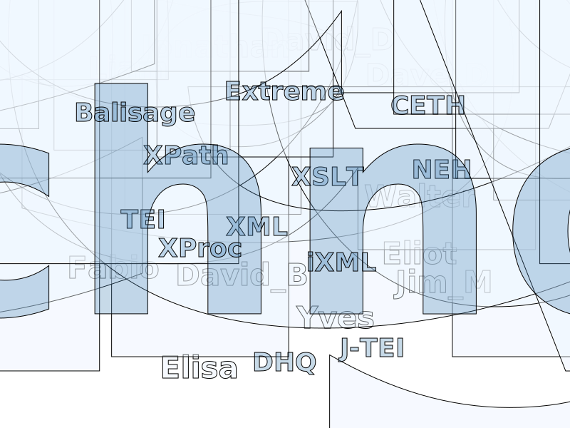

# First International iXML Symposium

## Slides

1. [Laminator library home page](https://github.com/wendellpiez/Laminator/tree/main) with LMNL example
1. How to do it? [lib/readme.md](https://github.com/wendellpiez/Laminator/tree/main/lib) with data flow diagram
1. Closeup of [parse pipeline](https://github.com/wendellpiez/Laminator/tree/main/lib/xMNML/up/sawtooth-syntax)
1. parse pipeline - [XProc source](https://github.com/wendellpiez/Laminator/blob/main/lib/xMNML/up/sawtooth-syntax/sawteeth-to-xMNML.xpl)
1. [iXML grammar](https://github.com/wendellpiez/Laminator/blob/main/lib/xMNML/up/sawtooth-syntax/src/mnml-lmnl.ixml)
1. See the steps (with outputs) in [demo/baselines/cache directory](https://github.com/wendellpiez/Laminator/tree/main/demo/baselines/cache)
1. output of iXML step, [Housekeeper sample](https://github.com/wendellpiez/Laminator/blob/main/demo/baselines/cache/1_parsed/Housekeeper144-146.xml)
1. [xMNML output](https://github.com/wendellpiez/Laminator/blob/main/demo/baselines/cache/3_xmnml/Housekeeper144-146-xMNML.xml) (third step)
1. StoryLines diagrams - [Range maps](https://github.com/wendellpiez/Laminator/tree/main/demo/StoryLines)
  - [Julian and Maddalo Storyline](https://htmlpreview.github.io/?https://github.com/wendellpiez/Laminator/blob/main/demo/StoryLines/out/JulianandMaddalo_range-map.svg)]
  - **Julian and Maddalo** [LMNL source data](https://github.com/wendellpiez/Laminator/blob/main/demo/StoryLines/data/Julian_and_Maddalo.lmnl)  

1. [Sonnets demo diagrams](https://github.com/wendellpiez/Laminator/blob/main/demo/Sonnets/sonnet-list.md) (for old times' sake)
1. [Skip to the paper](overlap-meets-ixml.md)
1. [Some notes](approach.md)

Thanks!

Finally, many thanks to DB and AG for helping me prepare these materials.

## For readers

See the paper.

Also see some background / context here.

